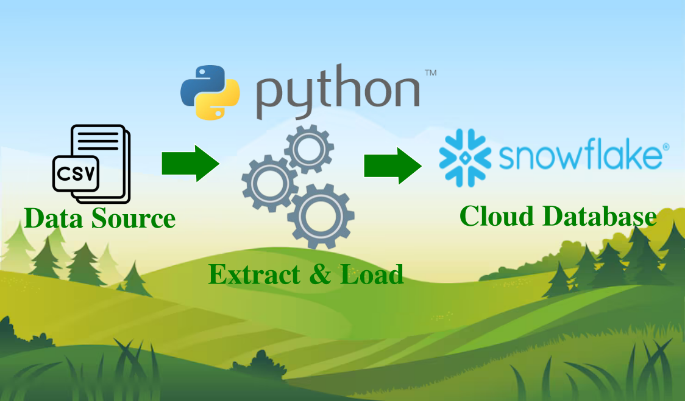

# csv_to_snowflake

# *Overview*
Project repo to demonstrate data ingestion from CSV file into Snowflake datawarehouse. Data ingestion start with create connection between local machine into Snowflake. 
# *Prerequisites*
To follow along this project need to be available on your system:
- Python3 with snowflake connector library
  ```bash
  sudo apt install python3

  pip install snowflake-connector-python
  ```
- Snowflake account
# *Project Flow*
Data ingestion from CSV to Snowflake:
1. Import necessary python libs -- snowflake.connector, csv, os
   ```python3
   import snowflake.connector
   import csv
   import os
   ```
3. Build connecton to Snoflake cloud
   ```python3
   conn = snowflake.connector.connect(
            user=user,
            password=password,
            account=account,
            warehouse=warehouse,
            database=database,
            schema=schema,
        )
   cursor = conn.cursor()
   ```
5. Create stage to temporary storage before load into Snowflake
   ```python3
   cursor.execute(f"CREATE STAGE IF NOT EXISTS {stage_name}")
   ```
7. Load csv file into stage
   ```python3
   cursor.execute(f"PUT file://{csv_file_path} @{stage_name} AUTO_COMPRESS=TRUE OVERWRITE=TRUE")
   ```
9. Get column form csv file's header
   ```python3
   with open(csv_file_path, 'r', encoding='utf-8') as f: # Explicit encoding
     reader = csv.reader(f)
     header = next(reader)  # Get the header row
     columns = ", ".join(f'"{col}"' for col in header) # Quote column names
     columns_for_table_creation = ", ".join(f'"{col}" VARCHAR' for col in header) # For CREATE TABLE
   ```
11. Create table if doesn't exist
    ```python3
    cursor.execute(f"""
      CREATE TABLE IF NOT EXISTS {table_name} ({columns_for_table_creation})
    """)
    ```
13. Load data into Snowflake from stage
    ```python3
    cursor.execute(f"""
      COPY INTO {table_name}
      FROM @{stage_name}/{os.path.basename(csv_file_path)}
      FILE_FORMAT = (FORMAT_NAME = '{file_format_name}')
      ON_ERROR = 'SKIP_FILE';  --  Important:  Handle errors robustly.
    """)
    ```
14. Remove file from stage
    ```python3
    cursor.execute(f"REMOVE @{stage_name}/{os.path.basename(csv_file_path)}")
    ```
16. Commit the transactions
    ```python3
    conn.commit()
    ```
18. Close connection
    ```python3
    finally:
        if cursor:
            cursor.close()
        if conn:
            conn.close()   
    ```
    
